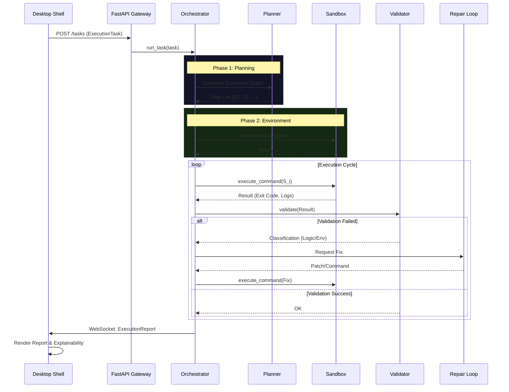

# Execution Flow Sequence


```mermaid
sequenceDiagram
    participant UI as Desktop Shell
    participant API as FastAPI Gateway
    participant ORC as Orchestrator
    participant PL as Planner
    participant SB as Sandbox
    participant VAL as Validator
    participant REP as Repair Loop

    UI->>API: POST /tasks (ExecutionTask)
    API->>ORC: run_task(task)
    
    rect rgb(20, 20, 40)
    Note over ORC, PL: Phase 1: Planning
    ORC->>PL: Generate Execution Graph
    PL-->>ORC: Step List [S1, S2, ...]
    end

    rect rgb(20, 40, 20)
    Note over ORC, SB: Phase 2: Environment
    ORC->>SB: Bootstrap(EnvConfig)
    SB-->>ORC: Ready
    end

    loop Execution Cycle
        ORC->>SB: execute_command(S_i)
        SB-->>ORC: Result (Exit Code, Logs)
        
        ORC->>VAL: validate(Result)
        
        alt Validation Failed
            VAL-->>ORC: Classification (Logic/Env)
            ORC->>REP: Request Fix
            REP-->>ORC: Patch/Command
            ORC->>SB: execute_command(Fix)
        else Validation Success
            VAL-->>ORC: OK
        end
    end

    ORC->>UI: WebSocket: ExecutionReport
    UI->>UI: Render Report & Explainability
```

## Telemetry Key
- **Blue**: Control Flow
- **Green**: Environment Prep
- **Red**: Error Handling & Repair
```
